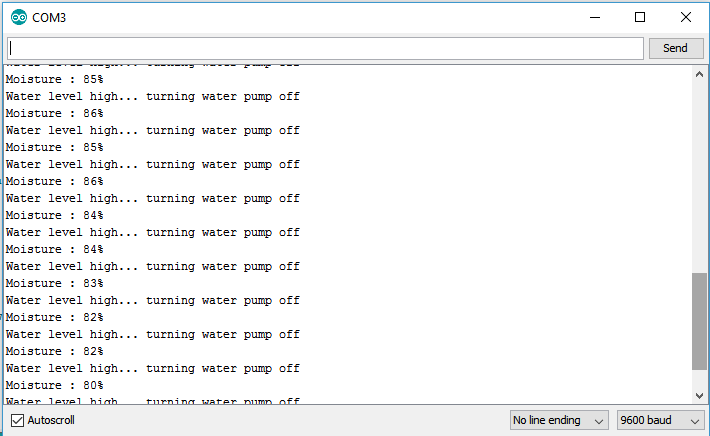

# Smart-Irrigation-System
IOT based System using various Analog Sensors for smart Irrigation

Smart low-cost irrigation system using Arduino UNO, YL-69 soil moisture sensor, submersible dc water pump, HC-05 bluetooth module(additional)

# Abstract
The project describes smart irrigation system using the concepts of Internet of Things. The system consists of an arduino which is the microcontroller and controls a 5V semi- submersible water pump according to the water level in the soil. The system also consist a bluetooth module that can be used to connect the user’s mobile application to the system. The user can receive sensor data values over the bluetooth using mobile application. The system automatically turns the water pump on when the moisture level in the soil is very low and turns the water pump off when the moisture level reaches the threshold value.

# Area of utility
The primary focus of this project is to help the farmers and reduce their work.

This project can be implemented in perennial plant irrigation land and gardening land.

# Hardware components used
1. Arduino UNO

2. HC-05 Bluetooth Module(OPTIONAL)

3. YL-69 soil moisture sensor

4. DC Water Pump

# Connections
1. HC-05 bluetooth module
Vcc to pin 5V of arduino uno

Ground to pin ground of arduino uno

Rx to pin 1(Tx) of arduino uno

Tx to pin 0(Rx) of arduino uno

2. YL-69 soil moisture sensor
A0 to analog pin 0 of arduino

GROUND to ground pin of arduino uno

Vcc to pin 5V of arduino uno

3. DC water pump
Black wire to ground pin of arduino uno

Red wire to pin 13 of arduino uno

# Screenshot of Arduino UNO Serial Monitor

